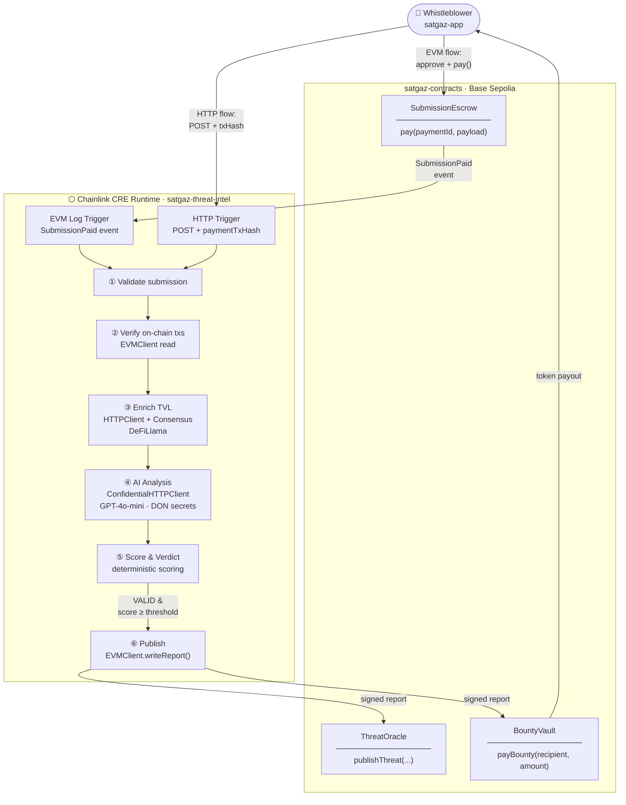

# SatGaz

Satellite-grade threat intelligence for DeFi, powered by **Chainlink CRE** (Compute Runtime Environment).

SatGaz is a decentralized whistleblower protocol. Anyone can submit on-chain evidence of a DeFi exploit in progress — rug pulls, admin key abuse, flash loan attacks, oracle manipulation — and earn a bounty if the threat is confirmed. The full analysis pipeline runs inside the **Chainlink CRE runtime**: on-chain verification, TVL enrichment via DeFiLlama, confidential AI analysis, deterministic scoring, and automated on-chain publishing — all without a centralized server.

---

## Chainlink CRE — The Core Engine

> **SatGaz is built on Chainlink CRE.** The [`satgaz-threat-intel`](./satgaz-threat-intel/) package is a CRE workflow. Every step between a user submitting a threat report and the final on-chain write runs inside the CRE runtime — verifiable, censorship-resistant, and autonomous. No backend. No centralized oracle. Just the Chainlink network.

| CRE Capability                | How SatGaz Uses It                                                                               |
| ----------------------------- | ------------------------------------------------------------------------------------------------ |
| **EVM Log Trigger**           | Auto-fires on every `SubmissionPaid` event from `SubmissionEscrow` — no polling, no cron         |
| **HTTP Trigger**              | Accepts direct threat submissions authenticated by a payment tx hash                             |
| **`HTTPClient` + Consensus**  | Fetches live TVL from DeFiLlama with `consensusIdenticalAggregation` — multiple nodes must agree |
| **`ConfidentialHTTPClient`**  | Calls OpenAI GPT-4o using a DON-managed secret `AI_API_KEY` — never exposed to operators         |
| **`EVMClient.writeReport()`** | Atomically writes signed verdicts to `ThreatOracle` and `BountyVault` on-chain                   |
| **`runtime.report()`**        | Generates a cryptographically signed, verifiable report payload                                  |
| **`prepareReportRequest()`**  | Packages ABI-encoded calldata for trusted on-chain delivery                                      |

---

## Monorepo Structure

```
satgaz-chainlink/
├── satgaz-app/           # React + Vite + Wagmi dApp — submission UI
├── satgaz-contracts/     # Solidity smart contracts — Foundry project
├── satgaz-threat-intel/  # Chainlink CRE workflow — threat analysis pipeline
├── project.yaml          # CRE project config (RPC endpoints per target)
└── secrets.yaml          # CRE secrets config (API keys via DON vault)
```

---

## System Architecture



---

## Submission Flows

### EVM Flow — fully on-chain trigger

```
User fills form → approve token → SubmissionEscrow.pay(paymentId, payload)
                                           │
                                  SubmissionPaid event
                                           │
                              CRE EVM Log Trigger fires
                                           │
                              Analysis pipeline runs automatically
                                           │
                              ThreatOracle + BountyVault updated on-chain
```

The **full JSON payload is embedded in the transaction log** so the CRE workflow can reconstruct the submission without any additional HTTP call.

### HTTP Flow — direct submission with payment proof

```
User calls SubmissionEscrow.pay() → records txHash
           │
           └─► POST to CRE HTTP endpoint { ...payload, paymentTxHash }
                          │
               CRE HTTP Trigger fires
                          │
               verifyPayment() reads the SubmissionPaid event on-chain
                          │
               Same analysis pipeline runs
```

---

## Quick Start

### Prerequisites

- [Node.js 20+](https://nodejs.org/) or [Bun](https://bun.sh/)
- [Foundry](https://book.getfoundry.sh/getting-started/installation) (`forge`, `cast`)
- [Chainlink CRE CLI](https://docs.chain.link/chainlink-automation) (`cre`)

### Clone

```bash
git clone https://github.com/your-org/satgaz-chainlink.git
cd satgaz-chainlink
```

### Step 1 — Deploy contracts

```bash
cd satgaz-contracts
cp .env.example .env        # fill PRIVATE_KEY and SEPOLIA_RPC_URL
forge install               # installs forge-std
forge build
forge script script/Deploy.s.sol --rpc-url sepolia --broadcast -vvvv
```

Copy the printed contract addresses into `satgaz-threat-intel/config.staging.json` and into `satgaz-app/.env`.

→ Full details: [satgaz-contracts/README.md](./satgaz-contracts/README.md)

### Step 2 — Configure the CRE workflow

```bash
cd satgaz-threat-intel
bun install
# edit config.staging.json with your deployed contract addresses
# edit secrets.yaml with your AI_API_KEY
```

Simulate locally:

```bash
cre workflow simulate satgaz-threat-intel \
  --target=staging-settings \
  --trigger-index 1 \
  --http-payload '{"targetProtocol":"Uniswap","targetChain":"ethereum-testnet-sepolia","threatType":"RUG_PREP","evidence":{...},"payoutAddress":"0x..."}'
```

→ Full details: [satgaz-threat-intel/README.md](./satgaz-threat-intel/README.md)

### Step 3 — Run the frontend

```bash
cd satgaz-app
cp .env.example .env        # fill VITE_ESCROW_ADDRESS
npm install
npm run dev
```

→ Full details: [satgaz-app/README.md](./satgaz-app/README.md)

---

## Contracts — Base Sepolia (Staging)

| Contract           | Address                                      |
| ------------------ | -------------------------------------------- |
| `SubmissionEscrow` | `0xf217CE89D15455e68276718e499eC87bF9b5b207` |
| `ThreatOracle`     | TBD                                          |
| `BountyVault`      | TBD                                          |

---

## License

MIT
